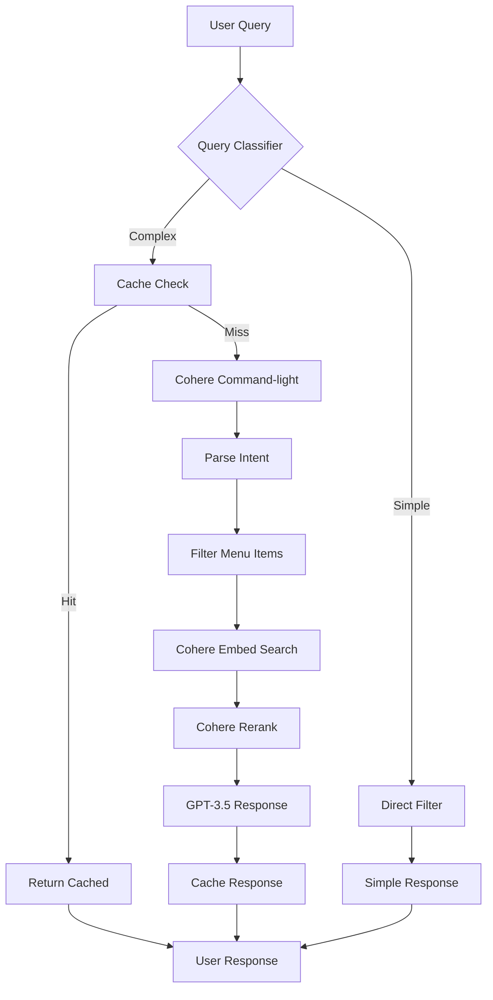

# Restaurant Menu AI Recommendation System - Project Context

## Project Overview
A web application that helps users discover menu items at restaurants through an AI-powered chatbox. The system uses a hybrid AI approach combining Cohere's semantic search and parsing capabilities with OpenAI's conversational abilities to understand user preferences, dietary restrictions, and cravings, then recommends suitable menu items from restaurant profiles.

## Tech Stack
- **Frontend**: Next.js 14 with App Router, TypeScript, Tailwind CSS
- **Backend**: Supabase (PostgreSQL, Auth, Storage, Realtime)
- **AI/NLP Stack (Hybrid System)**:
  - **Cohere Embed-v3**: Semantic search and menu item embeddings
  - **Cohere Rerank-v2**: Result optimization and relevance scoring
  - **Cohere Command-light**: Intent parsing and preference extraction
  - **OpenAI GPT-3.5-turbo**: Conversational responses and function calling
  - **USDA FoodData Central API**: Free nutrition data
- **Caching**: Upstash Redis for response caching
- **State Management**: Zustand
- **UI Components**: shadcn/ui
- **Deployment**: Vercel
- **Monitoring**: Custom analytics dashboard

## AI Architecture Details

### Hybrid AI System Components

1. **Intent Parsing Layer (Cohere Command-light)**
   - Extracts dietary restrictions, preferences, and constraints from natural language
   - Cost: ~$0.0001 per query
   - Used for: Structured data extraction

2. **Semantic Search Layer (Cohere Embed-v3)**
   - Pre-computed embeddings for all menu items
   - Real-time query embedding and similarity search
   - Model: `embed-english-light-v3.0` (1024 dimensions)
   - Cost: ~$0.0005 per 1000 embeddings

3. **Reranking Layer (Cohere Rerank-v2)**
   - Optimizes search results based on user preferences
   - Considers dietary restrictions, price, and flavor profiles
   - Cost: ~$0.001 per query

4. **Conversational Layer (OpenAI GPT-3.5-turbo)**
   - Generates natural, friendly responses
   - Explains recommendations with reasoning
   - Model: `gpt-3.5-turbo-1106` (with function calling)
   - Cost: ~$0.0015 per query

5. **Nutrition Layer (USDA API)**
   - Provides detailed nutritional information
   - Free tier: Unlimited queries
   - Used for: Calorie counts, macros, vitamins

### Query Processing Flow



## Database Schema (Supabase)

### Core Tables

```sql
-- Restaurants table
create table restaurants (
  id uuid default gen_random_uuid() primary key,
  name text not null,
  slug text unique not null,
  description text,
  cuisine_type text[],
  address jsonb,
  phone text,
  email text,
  opening_hours jsonb,
  logo_url text,
  cover_image_url text,
  created_at timestamp with time zone default timezone('utc'::text, now()),
  updated_at timestamp with time zone default timezone('utc'::text, now())
);

-- Menu categories
create table menu_categories (
  id uuid default gen_random_uuid() primary key,
  restaurant_id uuid references restaurants(id) on delete cascade,
  name text not null,
  description text,
  display_order integer default 0,
  created_at timestamp with time zone default timezone('utc'::text, now())
);

-- Menu items with embedding support
create table menu_items (
  id uuid default gen_random_uuid() primary key,
  restaurant_id uuid references restaurants(id) on delete cascade,
  category_id uuid references menu_categories(id) on delete set null,
  name text not null,
  description text,
  price decimal(10,2) not null,
  image_url text,
  ingredients text[],
  dietary_tags text[], -- ['vegan', 'gluten-free', 'dairy-free', 'nut-free', 'vegetarian', 'halal', 'kosher']
  flavor_profile jsonb, -- {spicy: 3, sweet: 1, sour: 2, salty: 2, umami: 1}
  prep_time integer, -- in minutes
  calories integer,
  nutrition_data jsonb, -- Full nutrition info from USDA
  embedding vector(1024), -- Cohere embeddings
  popularity_score integer default 0,
  is_available boolean default true,
  created_at timestamp with time zone default timezone('utc'::text, now()),
  updated_at timestamp with time zone default timezone('utc'::text, now())
);

-- Create index for vector similarity search
create index menu_items_embedding_idx on menu_items 
using ivfflat (embedding vector_cosine_ops)
with (lists = 100);

-- User preferences (for logged-in users)
create table user_preferences (
  id uuid default gen_random_uuid() primary key,
  user_id uuid references auth.users(id) on delete cascade,
  dietary_restrictions text[],
  favorite_cuisines text[],
  disliked_ingredients text[],
  price_range jsonb, -- {min: 0, max: 50}
  flavor_preferences jsonb, -- {spicy: 5, sweet: 2, etc.}
  created_at timestamp with time zone default timezone('utc'::text, now()),
  updated_at timestamp with time zone default timezone('utc'::text, now())
);

-- Chat sessions with enhanced tracking
create table chat_sessions (
  id uuid default gen_random_uuid() primary key,
  user_id uuid references auth.users(id) on delete cascade,
  restaurant_id uuid references restaurants(id) on delete cascade,
  messages jsonb[], -- Array of {role: 'user'|'assistant', content: string, timestamp: string}
  query_metadata jsonb, -- {intent: {}, cached: boolean, ai_services_used: []}
  created_at timestamp with time zone default timezone('utc'::text, now())
);

-- Recommendations tracking
create table recommendations (
  id uuid default gen_random_uuid() primary key,
  session_id uuid references chat_sessions(id) on delete cascade,
  menu_item_id uuid references menu_items(id) on delete cascade,
  recommendation_score float, -- Cohere rerank score
  reason text,
  accepted boolean,
  created_at timestamp with time zone default timezone('utc'::text, now())
);
```

### Caching Schema (Redis)

```typescript
// Cache key patterns
const cacheKeys = {
  // Query response cache
  response: 'response:{restaurantId}:{queryHash}',
  
  // Menu embeddings cache
  embeddings: 'embeddings:{restaurantId}',
  
  // User preference cache
  userPrefs: 'user:{userId}:preferences',
  
  // API usage tracking
  usage: 'usage:{date}:{service}',
  
  // Rate limiting
  rateLimit: 'rate:{userId}:{window}'
};
```

## Cost Structure & Optimization

### Expected Costs (Per 1,000 Daily Active Users)

| Service | Usage Pattern | Cost/Month | Optimization Strategy |
|---------|--------------|------------|----------------------|
| Cohere Embed | 50K embeddings/month | $25 | Batch processing, permanent cache |
| Cohere Rerank | 30K reranks/month | $30 | Only top 20 items |
| Cohere Command-light | 20K parses/month | $10 | Cache common patterns |
| GPT-3.5-turbo | 500K tokens/month | $75 | Smart routing, caching |
| Redis Cache | 1GB storage | $10 | 1-hour TTL |
| **Total** | - | **$150/month** | 60% queries avoid AI |

### Query Classification & Routing

```typescript
// Query complexity classification
const queryPatterns = {
  simple: [
    /^(show|list|what).*(vegan|vegetarian|gluten)/i,
    /^(cheapest|most expensive|under \$\d+)/i,
    /^(all|show me all)/i,
  ],
  
  medium: [
    /^(recommend|suggest).*(lunch|dinner)/i,
    /^(healthy|low calorie|high protein)/i,
    /^(spicy|mild|sweet)/i,
  ],
  
  complex: [
    /multiple dietary restrictions/i,
    /group order|party of/i,
    /similar to|like the/i,
    /mood|feeling|craving/i,
  ]
};

// Route to appropriate handler
function routeQuery(query: string): 'cache' | 'simple' | 'ai' {
  // Check cache first (30% hit rate expected)
  if (inCache(query)) return 'cache';
  
  // Simple queries (60% of total)
  if (matchesPattern(query, queryPatterns.simple)) return 'simple';
  
  // Complex queries need full AI (10% of total)
  return 'ai';
}
```

## Core Features Implementation

### 1. Restaurant Profile Page
- Display restaurant information with rich media
- Visual menu with categorized items and images
- Color-coded dietary tags with tooltips
- Real-time availability updates
- Interactive AI chatbox with streaming responses

### 2. AI Chatbox Functionality

#### Intent Parsing (Cohere Command-light)
```typescript
// Extract structured data from natural language
interface ParsedIntent {
  dietary: string[];           // ['vegan', 'gluten-free']
  flavors: string[];          // ['spicy', 'savory']
  priceConstraints: {
    min?: number;
    max?: number;
  };
  mealType: string;           // 'appetizer' | 'main' | 'dessert'
  ingredients: {
    wanted: string[];         // ['mushroom', 'cheese']
    avoided: string[];        // ['nuts', 'shellfish']
  };
  specialRequests: string[];  // ['extra spicy', 'no onions']
  occasion?: string;          // 'date night', 'quick lunch'
}
```

#### Semantic Search (Cohere Embed)
- Pre-compute embeddings for menu items on creation/update
- Real-time query embedding generation
- Cosine similarity search with PostgreSQL pgvector
- Top-K retrieval (K=20 for reranking)

#### Reranking (Cohere Rerank)
- Consider user preferences and constraints
- Multi-factor scoring:
  - Semantic relevance: 40%
  - Dietary match: 30%
  - Price fit: 20%
  - Popularity: 10%

#### Response Generation (GPT-3.5-turbo)
- Natural, conversational tone
- Explain reasoning for recommendations
- Handle follow-up questions
- Suggest complementary items

### 3. Menu Item Management
- Bulk import with CSV/Excel support
- Automatic embedding generation
- Rich media upload to Supabase Storage
- Real-time availability toggle
- Nutrition data sync with USDA API

### 4. User Features
- Preference learning over time
- Saved dietary profiles
- Order history integration
- Favorite items and restaurants
- Group ordering coordination

## Implementation Phases

### Phase 1: Foundation (Week 1-2)
1. **Database Setup**
   - Create Supabase schema with pgvector extension
   - Set up RLS policies for security
   - Configure storage buckets

2. **Basic UI Components**
   - Restaurant profile layout
   - Menu item cards with dietary tags
   - Simple chatbox interface

3. **Initial AI Integration**
   - Cohere Command-light for parsing
   - Basic filtering logic
   - Simple response generation

### Phase 2: Semantic Search (Week 3-4)
1. **Embedding Pipeline**
   - Batch embedding generation script
   - Supabase Edge Function for updates
   - Vector similarity search implementation

2. **Search Optimization**
   - Index configuration for pgvector
   - Query optimization
   - Result caching in Redis

3. **Enhanced Chat Flow**
   - Multi-turn conversation support
   - Context preservation
   - Error handling

### Phase 3: Advanced Features (Week 5-6)
1. **Reranking Implementation**
   - Cohere Rerank integration
   - Multi-factor scoring algorithm
   - A/B testing framework

2. **User Personalization**
   - Preference tracking
   - Learning algorithm
   - Recommendation improvement

3. **Performance Optimization**
   - Response streaming
   - Predictive caching
   - Load balancing

### Phase 4: Polish & Scale (Week 7-8)
1. **Monitoring & Analytics**
   - Cost tracking dashboard
   - Performance metrics
   - User behavior analysis

2. **Edge Cases & Error Handling**
   - Graceful degradation
   - Fallback mechanisms
   - User feedback integration

3. **Production Readiness**
   - Load testing
   - Security audit
   - Documentation

## Detailed Component Structure

```
/app
  /restaurant
    /[slug]
      page.tsx                 # Restaurant profile page
      loading.tsx              # Skeleton loader
      /components
        MenuSection.tsx        # Menu display with filters
        ChatBox.tsx           # AI chat interface
        MenuItem.tsx          # Individual menu item card
        DietaryTag.tsx        # Colored dietary badges
        NutritionModal.tsx    # Detailed nutrition popup
  
  /api
    /chat
      route.ts                # Main chat endpoint
    /chat/stream
      route.ts                # Streaming responses
    /recommendations
      route.ts                # Get filtered recommendations
    /embeddings
      generate/route.ts       # Batch embedding generation
      update/route.ts         # Update single item
    /restaurants
      route.ts                # Restaurant CRUD
      [id]/menu/route.ts      # Menu management
    /analytics
      usage/route.ts          # Track API usage
      costs/route.ts          # Cost monitoring
  
  /admin
    /dashboard
      page.tsx                # Admin overview
    /costs
      page.tsx                # Cost monitoring dashboard
    /menu
      page.tsx                # Menu management
      import/page.tsx         # Bulk import

/components
  /ui                         # shadcn/ui components
  /shared
    Navigation.tsx
    Footer.tsx
    ErrorBoundary.tsx
  /chat
    MessageBubble.tsx
    TypingIndicator.tsx
    QuickReplies.tsx
    RecommendationCard.tsx

/lib
  /supabase
    client.ts                 # Browser client
    server.ts                 # Server client
    admin.ts                  # Admin client
    types.ts                  # Generated types
  
  /ai
    /hybrid-system.ts         # Main AI orchestration
    /cohere
      embed.ts                # Embedding functions
      rerank.ts               # Reranking logic
      parse.ts                # Intent parsing
    /openai
      chat.ts                 # Response generation
      functions.ts            # Function definitions
    /cache
      redis.ts                # Redis client
      strategies.ts           # Caching strategies
    /fallbacks
      simple-search.ts        # Keyword matching
      error-handlers.ts       # Graceful degradation
    /cost-optimizer.ts        # Cost optimization logic
    /prompts.ts              # Prompt templates
  
  /utils
    dietary-tags.ts           # Tag definitions & colors
    price-formatter.ts        # Currency formatting
    query-classifier.ts       # Query complexity detection
    embeddings-manager.ts     # Embedding utilities
    nutrition-mapper.ts       # USDA data mapping

/hooks
  useChat.ts                  # Chat state management
  useRestaurant.ts           # Restaurant data
  useRecommendations.ts      # Recommendation logic
  useUserPreferences.ts      # User preference tracking
  useAnalytics.ts            # Analytics tracking

/scripts
  generate-embeddings.ts      # Batch embedding script
  import-menu.ts             # CSV/Excel import
  migrate-data.ts            # Data migration
  monitor-costs.ts           # Cost monitoring
```

## API Endpoints Detailed

### `/api/chat` (POST)
Processes user messages with full hybrid AI pipeline.

**Request:**
```typescript
{
  message: string;
  restaurantId: string;
  sessionId?: string;
  userPreferences?: {
    dietary: string[];
    priceRange: { min: number; max: number };
  };
  streamResponse?: boolean;
}
```

**Response:**
```typescript
{
  reply: string;
  recommendations: Array<{
    id: string;
    name: string;
    price: number;
    description: string;
    dietary_tags: string[];
    score: number;
    reason: string;
  }>;
  sessionId: string;
  metadata: {
    cached: boolean;
    processingTime: number;
    servicesUsed: string[];
  };
}
```

### `/api/embeddings/generate` (POST)
Batch generates embeddings for menu items.

**Request:**
```typescript
{
  restaurantId: string;
  items?: string[]; // Item IDs, or all if not specified
  force?: boolean;  // Regenerate even if exists
}
```

### `/api/analytics/costs` (GET)
Returns cost breakdown and usage statistics.

**Response:**
```typescript
{
  daily: {
    date: string;
    total: number;
    breakdown: {
      cohere_embed: { calls: number; cost: number };
      cohere_rerank: { calls: number; cost: number };
      cohere_command: { calls: number; cost: number };
      openai: { calls: number; tokens: number; cost: number };
    };
  };
  projections: {
    monthly: number;
    perUser: number;
    perQuery: number;
  };
  optimization: {
    cacheHitRate: number;
    simpleQueryRate: number;
    recommendations: string[];
  };
}
```

## AI Prompt Engineering

### System Prompts

#### Cohere Command-light (Intent Parsing)
```
Extract dietary preferences and constraints from the user message.
Return a structured JSON with these fields:
- dietary: array of dietary restrictions (vegan, gluten-free, etc.)
- flavors: array of flavor preferences (spicy, sweet, savory)
- priceConstraints: object with min/max values
- mealType: string (appetizer, main, dessert, any)
- ingredients: object with wanted/avoided arrays
- specialRequests: array of special modifications

Be precise and only include explicitly mentioned constraints.
```

#### GPT-3.5-turbo (Response Generation)
```
You are a helpful restaurant menu assistant for {restaurantName}.
Your personality is friendly, knowledgeable, and enthusiastic about food.

Guidelines:
1. Be conversational and warm
2. Explain why you're recommending each dish
3. Mention dietary accommodations and price
4. Suggest pairings or modifications when relevant
5. Keep responses concise but informative
6. Use food-related emojis sparingly for friendliness

Current context:
- User preferences: {preferences}
- Previous orders: {orderHistory}
- Time of day: {timeContext}
```

### Query Examples & Expected Behavior

1. **Simple Query**: "Show me vegan options"
   - Route: Simple filter (no AI needed)
   - Response time: <100ms
   - Cost: $0

2. **Medium Query**: "I want something spicy for lunch under $15"
   - Route: Cohere Command-light → Filter → GPT-3.5
   - Response time: 500-800ms
   - Cost: ~$0.002

3. **Complex Query**: "I'm hosting a dinner party with vegan and keto guests, need appetizers that work for both"
   - Route: Full pipeline with reranking
   - Response time: 1-2s
   - Cost: ~$0.005

## Performance Optimization

### Caching Strategy
1. **Permanent Cache**
   - Menu item embeddings
   - Restaurant metadata
   - Dietary tag mappings

2. **Long-term Cache (24 hours)**
   - Popular query patterns
   - Common recommendations
   - User preferences

3. **Short-term Cache (1 hour)**
   - Recent chat responses
   - Search results
   - Reranking scores

### Database Optimization
```sql
-- Indexes for performance
CREATE INDEX idx_menu_items_restaurant ON menu_items(restaurant_id);
CREATE INDEX idx_menu_items_dietary ON menu_items USING GIN(dietary_tags);
CREATE INDEX idx_menu_items_price ON menu_items(price);
CREATE INDEX idx_menu_items_available ON menu_items(is_available);

-- Materialized view for popular items
CREATE MATERIALIZED VIEW popular_menu_items AS
SELECT m.*, 
       COUNT(r.id) as recommendation_count,
       AVG(r.recommendation_score) as avg_score
FROM menu_items m
LEFT JOIN recommendations r ON m.id = r.menu_item_id
GROUP BY m.id
ORDER BY recommendation_count DESC;
```

### Response Streaming
- Stream GPT-3.5 responses for better UX
- Progressive rendering of recommendations
- Optimistic UI updates

## Security & Privacy

### Data Protection
1. **User Data**
   - Dietary restrictions encrypted at rest
   - No PII in chat logs
   - GDPR-compliant data handling

2. **API Security**
   - Rate limiting per user/IP
   - API key rotation
   - Request validation

3. **Content Filtering**
   - Inappropriate content detection
   - Allergy safety warnings
   - Medical disclaimer for nutrition info

### RLS Policies
```sql
-- Users can only see their own preferences
CREATE POLICY user_preferences_policy ON user_preferences
  FOR ALL USING (auth.uid() = user_id);

-- Public read for menu items
CREATE POLICY menu_items_read ON menu_items
  FOR SELECT USING (true);

-- Only restaurant owners can modify
CREATE POLICY menu_items_write ON menu_items
  FOR ALL USING (
    auth.uid() IN (
      SELECT owner_id FROM restaurants 
      WHERE id = menu_items.restaurant_id
    )
  );
```

## Monitoring & Analytics

### Key Metrics to Track
1. **Performance Metrics**
   - Response time (p50, p95, p99)
   - Cache hit rate
   - Error rate
   - API latency by service

2. **Business Metrics**
   - Queries per user
   - Recommendation acceptance rate
   - Most requested dietary filters
   - Peak usage times

3. **Cost Metrics**
   - Cost per query
   - Service breakdown
   - Monthly burn rate
   - Cost per user

### Alerting Thresholds
- Response time > 2s for 5 minutes
- Error rate > 5%
- Daily cost > $20
- Cache hit rate < 20%

## Development Workflow

### Environment Setup
```bash
# Required environment variables
NEXT_PUBLIC_SUPABASE_URL=
NEXT_PUBLIC_SUPABASE_ANON_KEY=
SUPABASE_SERVICE_ROLE_KEY=

COHERE_API_KEY=
OPENAI_API_KEY=

UPSTASH_REDIS_URL=
UPSTASH_REDIS_TOKEN=

# Optional
SENTRY_DSN=
ANALYTICS_ID=
```

### Development Commands
```bash
# Install dependencies
npm install

# Run development server
npm run dev

# Generate types from Supabase
npm run generate-types

# Run embedding generation
npm run embeddings:generate

# Run cost analysis
npm run analyze:costs

# Run tests
npm run test
```

### Git Workflow
- Feature branches from `develop`
- PR reviews required
- Automated testing on PR
- Semantic versioning

## Future Enhancements

### Short-term (Next Quarter)
1. **Voice Input**: Speech-to-text for accessibility
2. **Multi-language Support**: Spanish, French, Mandarin
3. **Photo Search**: "Find something like this" with images
4. **Meal Planning**: Weekly meal suggestions
5. **Loyalty Integration**: Points and rewards

### Long-term (Next Year)
1. **Mobile Apps**: iOS and Android native apps
2. **AR Menu Visualization**: See dishes in AR
3. **Predictive Ordering**: AI learns patterns
4. **Kitchen Integration**: Real-time prep times
5. **Franchise Support**: Multi-location management
6. **Advanced Analytics**: Restaurant insights dashboard
7. **Voice Assistants**: Alexa/Google Home integration

## Troubleshooting Guide

### Common Issues

1. **Slow Responses**
   - Check Redis connection
   - Verify embedding indices
   - Monitor API rate limits

2. **Inaccurate Recommendations**
   - Regenerate embeddings
   - Check reranking configuration
   - Verify dietary tag accuracy

3. **High Costs**
   - Increase cache TTL
   - Optimize query routing
   - Batch more operations

4. **Embedding Failures**
   - Check vector dimensions (1024)
   - Verify pgvector extension
   - Monitor Cohere API status